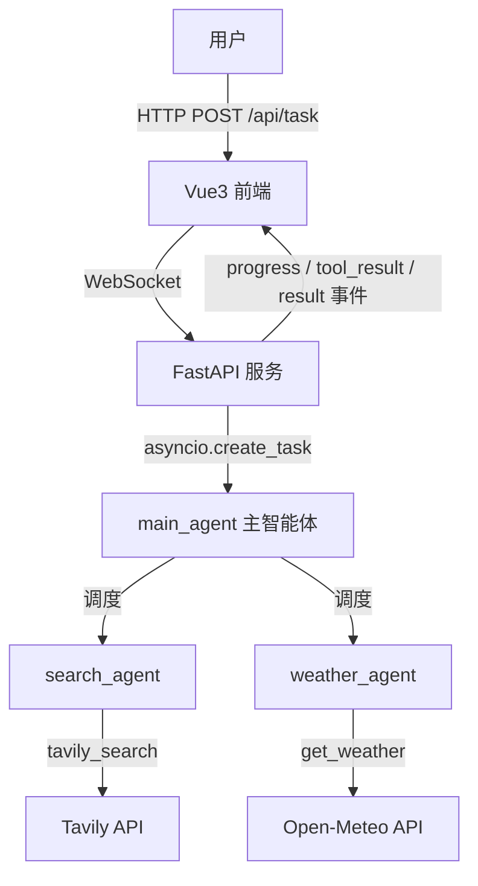

# MultiAgent-Search

从零手搓的多智能体搜索系统：一个主智能体根据用户请求调度联网搜索 / 天气查询两个子智能体，全过程通过 WebSocket 实时可视化。

不依赖 LangChain / LangGraph 等编排框架——agent 循环、工具调用、多智能体调度、进度推送全部手写实现，用于深入理解 agent 系统的底层机制。

## 功能

- **多智能体调度**：主智能体分析请求，决定调度哪个子智能体（可并发多个），汇总结果作答
  - `search_agent`：联网搜索（Tavily API）
  - `weather_agent`：天气查询（Open-Meteo API，无需 key）
- **实时过程可视化**：调度决策、工具执行、最终回答通过 WebSocket 逐条推送，前端日志式呈现
- **统一循环引擎**：所有智能体复用同一个 tool-calling 循环（`run_tool_loop`），新增子智能体只需一份三元组配置
- **聊天式前端**：Vue3 + TypeScript，Markdown 渲染 + 代码语法高亮

## 架构



一次请求的完整链路：

```
用户提问 → POST /api/task（立即返回 task_id）
        → 后台执行 main_agent 循环
        → 主智能体 function calling 调度子智能体
        → 子智能体独立上下文中执行工具、消化结果，只返回摘要
        → 主智能体汇总，WS 推送 result
前端全程通过 WS 接收 progress / tool_result / result / error 事件
```

## 性能优化实录

系统跑通后发现一次"帮我搜索最近的热门消息"要 **~2 分钟**。通过事件日志定位到三个问题并修复：

| 问题 | 原因 | 修复 | 效果 |
|---|---|---|---|
| 一次提问触发 4 次搜索 | 主智能体无调度预算，模糊请求被穷举成多角度搜索 | 主智能体 prompt 增加调度预算（简单问题 ≤1 次、禁止同轮重复调度）与停止条件 | 搜索次数 4 → 1 |
| 子智能体内部反复搜索 | 子智能体循环继承 8 轮上限，无收敛约束 | 子智能体 prompt 硬性规定"只调用一次 tavily_search" | 单次子智能体调用耗时砍半 |
| 同轮多个工具调用串行执行 | 循环内逐个 `await` | 同轮无依赖的调用改为 `asyncio.gather` 并发 | 并行收益 |

**结果：单次查询端到端延迟 ~2 分钟 → ~2 秒（约 98% 降低）**，且未改动任何核心逻辑——全部收益来自调度策略（prompt 约束）与并发化。

## 快速开始

```bash
# 后端（Python 3.10+）
cd backend
python -m venv .venv && .venv/Scripts/activate   # Windows；macOS/Linux 用 source .venv/bin/activate
pip install -r requirements.txt
copy .env.example .env                            # 填入 LLM 与 Tavily 的 key
python run.py                                     # 服务起在 :8001

# 前端（Node 18+）
cd frontend
npm install
npm run dev                                       # 页面起在 :5173，/api 已代理到后端
```

需要配置的环境变量（见 `backend/.env.example`）：

| 变量 | 说明 |
|---|---|
| `LLM_API_KEY` / `LLM_BASE_URL` / `LLM_MODEL` | 任意 OpenAI 兼容模型（DeepSeek / 通义均实测可用） |
| `TAVILY_API_KEY` | 联网搜索用，[tavily.com](https://tavily.com) 免费档每月 1000 次 |

## 技术栈

- **后端**：Python / FastAPI / WebSocket / OpenAI 兼容 SDK（异步） / httpx
- **前端**：Vue3（script setup）/ TypeScript / Vite / axios / marked + highlight.js + DOMPurify
- **无 agent 框架依赖**：tool-calling 循环、多智能体编排、上下文隔离均为手写实现

## Roadmap

- [ ] 流式输出（token 级打字机效果）
- [ ] 评测集：固化测试用例，量化 prompt 与调度策略改动的影响
- [ ] 代码执行子智能体（Docker 沙箱）
- [ ] 对话历史持久化
- [ ] RAG / NL2SQL 子智能体
