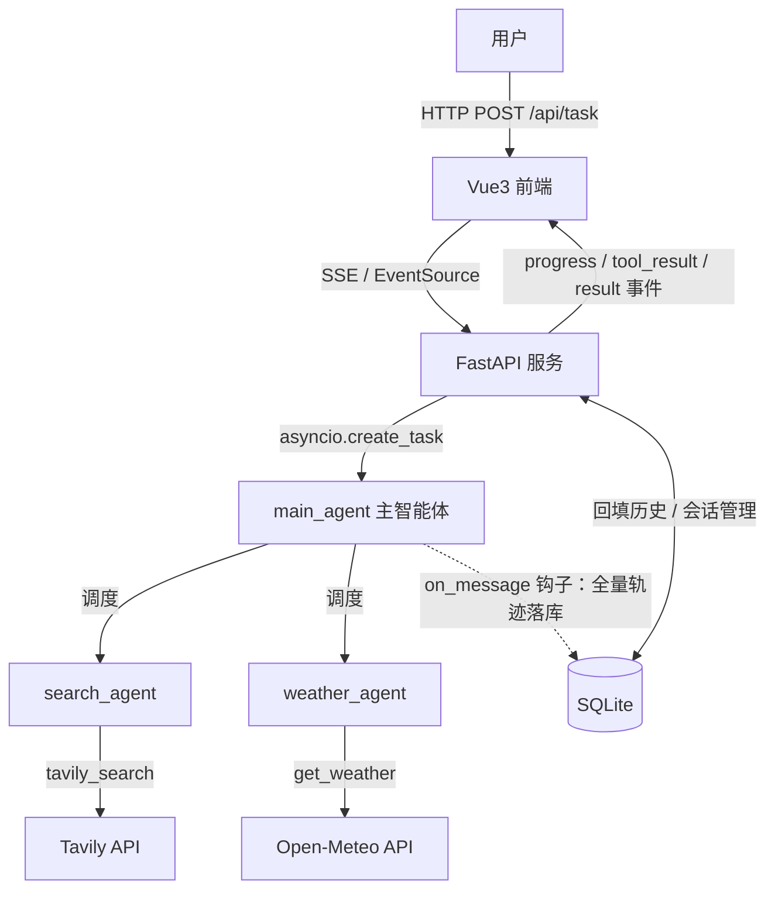

# MultiAgent-Search

从零手搓的多智能体搜索系统：一个主智能体根据用户请求调度联网搜索 / 天气查询两个子智能体，全过程通过 SSE 实时可视化。

不依赖 LangChain / LangGraph 等编排框架——agent 循环、工具调用、多智能体调度、进度推送全部手写实现，用于深入理解 agent 系统的底层机制。

## 功能

- **多智能体调度**：主智能体分析请求，决定调度哪个子智能体（可并发多个），汇总结果作答
  - `search_agent`：联网搜索（Tavily API，时事查询走新闻索引并按天数过滤）
  - `weather_agent`：天气查询（Open-Meteo API，无需 key）
- **会话持久化**：会话与消息落盘 SQLite（SQLAlchemy 2.0 async + aiosqlite）。存储侧保留**全量轨迹**（assistant 中间轮 / tool 调用结果 / 最终回答，逐条增量落库），回填侧只喂**文本轮**（用户提问 + 最终回答），工具噪音不进上下文
- **多轮对话**：主智能体带上下文理解追问（"那上海呢？"），历史跨服务重启、页面刷新均可恢复；子智能体保持无状态、拿到的 query 永远自包含
- **多会话管理**：侧边栏列表 / 新建 / 切换；页面加载与断线重连后自动拉历史对齐，当前会话记在 localStorage
- **时效性搜索**：两个智能体的 prompt 注入当天日期；时事类查询走 Tavily 新闻索引（`topic=news` + `days` 过滤），结果携带 `published_date`
- **评测集**：断言调度行为与回答质量，支持单轮/多轮用例，报告存档供版本间 diff
- **实时过程可视化**：调度决策、工具执行、最终回答通过 SSE 逐条推送（token 级流式），前端日志式呈现、断线自动重连
- **统一循环引擎**：所有智能体复用同一个 tool-calling 循环（`run_tool_loop`），新增子智能体只需一份三元组配置
- **聊天式前端**：Vue3 + TypeScript，Markdown 渲染 + 代码语法高亮

## 架构



一次请求的完整链路：

```
用户提问 → POST /api/task（立即返回 task_id）
        → 后台任务先回填该会话的文本轮历史（不含工具轨迹），拼进主智能体的 messages
        → user 消息先落库，随后执行 main_agent 循环（中途崩溃提问不丢）
        → 主智能体 function calling 调度子智能体
        → 子智能体独立上下文中执行工具、消化结果，只返回摘要
        → 每条消息（assistant 中间轮 / tool 结果 / 最终回答）经 on_message 钩子增量落库
        → 主智能体汇总，SSE 推送 result
前端全程通过 SSE 接收 progress / tool_result / token / result / error 事件
```

## 性能优化实录

系统跑通后发现一次"帮我搜索最近的热门消息"要 **~2 分钟**。通过事件日志定位到三个问题并修复：

| 问题 | 原因 | 修复 | 效果 |
|---|---|---|---|
| 一次提问触发 4 次搜索 | 主智能体无调度预算，模糊请求被穷举成多角度搜索 | 主智能体 prompt 增加调度预算（简单问题 ≤1 次、禁止同轮重复调度）与停止条件 | 搜索次数 4 → 1 |
| 子智能体内部反复搜索 | 子智能体循环继承 8 轮上限，无收敛约束 | 子智能体 prompt 硬性规定"只调用一次 tavily_search" | 单次子智能体调用耗时砍半 |
| 同轮多个工具调用串行执行 | 循环内逐个 `await` | 同轮无依赖的调用改为 `asyncio.gather` 并发 | 并行收益 |

**结果：单次查询端到端延迟 ~2 分钟 → ~2 秒（约 98% 降低）**，且未改动任何核心逻辑——全部收益来自调度策略（prompt 约束）与并发化。

## 会话持久化设计

表结构见 `docs/init.sql`（开发期手动建表，SQL 与 ORM 定义双处对齐）。几个核心决策：

- **存全量、喂精简**：存储侧保留完整事件流——`user` 提问、`assistant` 中间轮（带 `tool_calls`）、`tool` 结果、最终回答，逐条增量落库；回填 LLM 只取**文本轮**（`role IN (user, assistant)`、`tool_calls IS NULL`、`content != ''`）。调试时可完整回放，上下文里没有工具噪音
- **事件流模型**：一条消息一行（不是一问一答一行），`tool_call_id` 负责配对"调用声明 ↔ 调用结果"；一次询问落库行数 = 1 (user) + R (assistant 行) + T (tool 行)
- **增量落库**：`on_message` 钩子在每条消息产生的瞬间写库，而非跑完一次性写入——中途崩溃保留现场，运行状态可实时查询

## 流式推送迁移实录（WebSocket → SSE）

推送是纯单向流（进度 / token / 结果），而客户端上行全是普通 HTTP——WebSocket 的双向通道只用了一半。迁移到 SSE 后，`EventSource` 自带断线重连（手写重连逻辑整个删掉），服务端从"连接字典 + accept 循环"简化为"会话队列 + StreamingResponse"。

迁移中踩到最深的坑是 **vite dev 代理攒包**：页面刷新后历史约 20 秒才显示。

- **排查**（逐层探测法）：直连后端响应头 `t+0.59s`；经 vite 代理 `t+15.47s`，且与第一条 keepalive 同刻到达——代理一直攒着响应头，直到第一块数据才转发，而首块数据恰好是 15 秒后的心跳
- **修复**：`generate()` 开头立即 `yield ": connected\n\n"`（SSE 注释行，浏览器忽略），让代理在连接瞬间就 flush 响应头
- **本质**：流式链路的每一层都可能缓冲（浏览器 / dev 代理 / nginx / 网关）——nginx 侧由 `X-Accel-Buffering: no` 响应头防住，dev 代理侧靠"连接即吐一行"防住

## 评测集

prompt 和调度策略的每次改动都用同一套用例量化，避免"感觉上变好了"。

```bash
cd backend
python -m evals.runner                       # 全量
python -m evals.runner multi_turn_coref_001  # 只跑指定用例（调 prompt 时用）
```

用例写在 `evals/cases.yml`：单轮用例是一问 + expect；多轮用例用 `turns` 数组，历史逐轮累积喂给主智能体（与线上回填策略一致）。expect 支持的断言：

| 字段 | 含义 |
|---|---|
| `subagents` | 本轮应该调度哪些子智能体（精确匹配） |
| `max_tool_calls` | 本轮工具调用次数上限（调度预算） |
| `must_contain` | 回答必须包含的关键词（全部命中） |
| `any_contain` | 回答命中任一即可的关键词 |
| `max_latency_s` | 本轮耗时上限 |

每轮报告存档在 `evals/results/report_*.json`，供不同版本之间 diff 对比。

### 两条实战教训

- **结构全过 ≠ 内容正确**：`tavily_search` 曾因 key 里一个多余空格（`"content "`）把所有正文取成空串，4 个用例照样 4/4 通过——调度、预算、延迟全对，回答却是一封道歉信。结构性断言之外，必须保留 `answer_preview` 人肉复核这一层。
- **对自由生成文本逐字断言必然 flaky**：模型这轮写"温度"、下轮写"气温"，逐字断言今天过明天就挂。断言要锚定稳定产物——实体名、数值单位、来源 URL；措辞类关键词用 `any_contain` 兜底。

## 快速开始

```bash
# 后端（Python 3.10+）
cd backend
python -m venv .venv && .venv/Scripts/activate   # Windows；macOS/Linux 用 source .venv/bin/activate
pip install -r requirements.txt
copy .env.example .env                            # 填入 LLM 与 Tavily 的 key
python -c "import sqlite3; sqlite3.connect('app.db').executescript(open('../docs/init.sql', encoding='utf-8').read())"   # 手动建表（schema 见 docs/init.sql）
python run.py                                     # 服务起在 :8001

# 前端（Node 18+）
cd frontend
npm install
npm run dev                                       # 页面起在 :5173，/api 已代理到后端
```

需要配置的环境变量（见 `backend/.env.example`）：

| 变量 | 说明 |
|---|---|
| `LLM_API_KEY` / `LLM_BASE_URL` / `LLM_MODEL` | 任意 OpenAI 兼容模型（DeepSeek / 通义均实测可用） |
| `TAVILY_API_KEY` | 联网搜索用，[tavily.com](https://tavily.com) 免费档每月 1000 次 |
| `DB_URL` | SQLite 连接串，默认 `sqlite+aiosqlite:///./app.db`（相对 backend 启动目录） |

## API 一览

| 方法 | 路径 | 说明 |
|---|---|---|
| `POST` | `/api/task` | 提交提问（`query` + `session_id`），立即返回 `task_id`，结果经 SSE 推送 |
| `GET` | `/api/events/{session_id}` | SSE 事件流：`progress` / `tool_result` / `token` / `result` / `error` |
| `GET` | `/api/session` | 会话列表（最近活跃在前，含标题） |
| `GET` | `/api/session/{id}/messages` | 指定会话的展示用历史（文本轮、正序） |
| `DELETE` | `/api/session/{id}` | 删除会话（消息级联清理） |
| `GET` | `/health` | 健康检查 |

## 技术栈

- **后端**：Python / FastAPI（SSE 流式推送，StreamingResponse）/ OpenAI 兼容 SDK（异步） / httpx / SQLAlchemy 2.0 async + aiosqlite / PyYAML（评测用例）
- **前端**：Vue3（script setup）/ TypeScript / Vite / axios + EventSource / marked + highlight.js + DOMPurify
- **无 agent 框架依赖**：tool-calling 循环、多智能体编排、上下文隔离均为手写实现

## Roadmap

- [x] 评测集：固化测试用例，量化 prompt 与调度策略改动的影响
- [x] 多轮对话：主智能体带上下文做指代消解
- [x] 流式输出（token 级打字机效果）
- [x] 会话持久化：SQLite 全量轨迹落盘 + 多会话侧边栏（刷新 / 断线重连后回放）
- [ ] 任务状态追踪：重连后可查"是否有任务在跑、跑到哪轮"
- [ ] 代码执行子智能体（Docker 沙箱）
- [ ] RAG / NL2SQL 子智能体
